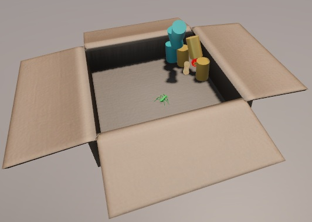
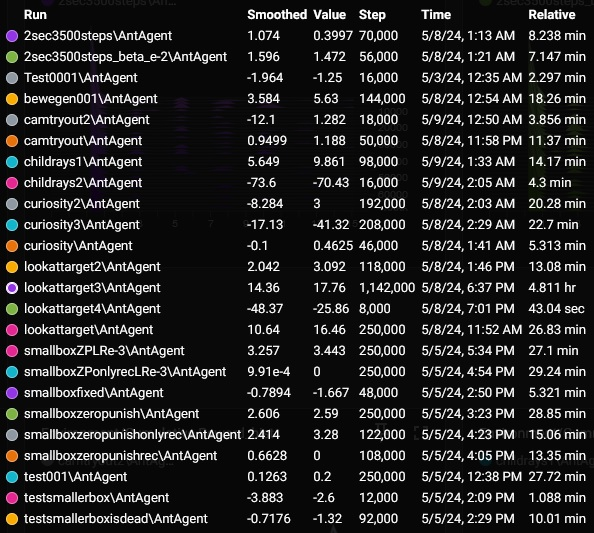
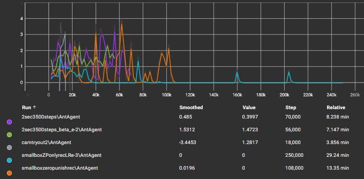

# SmartAnt: mier en mens werken samen

## Inleiding

Machine learning is een hot topic. Om hier op een leuke manier kennis mee te maken gaan we in dit project aan de slag met Unity en de ML Agents extensie. Los van het feit dat een virtuele mier bepaald gedrag aangeleerd zal krijgen is de interactie van de gebruiker, die de beleving via een VR bril ervaart, ook nodig. Op deze manier wordt er een samenwerking gecreëerd die aantoont dat machine learning niet per se altijd op zichzelf zaken moet kunnen uitvoeren. In het leerproces zelf zal het gedrag van de mens wel gesimuleerd moeten worden om het proces aanzienlijk te versnellen.

## Korte Samenvatting

Dit project laat zien hoe machine learning kan worden toegepast in Unity met behulp van de ML Agents extensie. Een virtuele mier leert bepaald gedrag aan en werkt samen met een gebruiker die via een VR-bril de ervaring beleeft. Objecten die de mens richting de mier moet werpen, worden willekeurig in een doos gespawnd om het leerproces te versnellen. Het doel is dat de mier deze objecten oppakt en naar gestapelde cilinders werpt. In deze tutorial leer je hoe je een basisopstelling kan bouwen waarin de mier het juiste gedrag zal kunnen aanleren. Lees verder om te ontdekken hoe je dit zelf in Unity kunt nabouwen.

## Installatie

Download de hele repository om aan de slag te gaan met dit project.
Er wordt aangeraden om dezelfde software versies te gebruiken zoals hieronder vermeld om het project te openen.

Unity: 2022.3.14f1

ML Agents: 2.0.1

## Verloop simulatie & spel

In het spel zelf is het de bedoeling om in één minuut zo vaak mogelijk de mier te helpen met de cilinders omver te werpen. Dit doe je door zelf objecten te spawnen in een kom, deze op te pakken en vervolgens naar de mier te gooien in de doos. Je kan na afloop op het scoreboard links van je kijken hoeveel punten je hebt behaald. Elk punt is één cilinder.

Het grootste verschil tussen de simulatie en het spel zelf met VR interactie, is de omgeving zelf en dat de menselijke interactie in de simulatie wordt nagebootst door het random spawnen van objecten in de doos.

In dit project zijn er twee scenes.
- Scene Room: dit is de totaalbeleving met VR interactie.
- Scene Simulation: dit is de leeromgeving, gebruikt om de mier te trainen.

Open Scene Simulation en bekijk het mier object. Zoals u kan zien bevat dit meerdere scripts. Open het AgentLearning script en lees verder om te weten te komen welke acties, observaties er in dit script zijn uitgewerkt zodat u kan volgen hoe de simulatie is opgesteld en werkt.

## Details van de simulatie

### Agent object (de mier)

In de simulatie zelf spawned de mier en de cilinders met een lichte willekeur qua coordinaten. De mier zelf kan verschillende __discrete acties__ uitvoeren:
- Links/rechts draaien
- Vooruit/achteruit bewegen
- Indien deze een object vastheeft, dit naar voren werpen

Het oppikken van objecten gebeurd automatisch, wanneer de mier ermee in aanraking komt. Hier is dus geen specifieke actie voor vereist.

Beloningen:
- Het oprapen van een werpbaar object
- Vanaf een werpbaar object is opgeraapt, kijken naar het center van de cilinders
- Elke geraakte cilinder waar een object naar is gesmeten, levert punten op

Afstraffingen:
- Om een bepaald tijdsinterval wordt er een straf gegeven om de mier te stimuleren sneller acties te ondernemen

Einde scenario:

- Als de mier een wand aanraakt van de doos
- Als de mier zelf één van de cilinders aanraakt

### Andere objecten

Throwables:

In de folder Assets/Resources/Throwables kan je de verschillende objecten vinden die de mier kan oprapen en gooien (pinda, aardbei, ... ). Deze hebben een TouchedByAnt script dat controleert of de mier het object wel degelijk heeft aangeraakt. Voor de simulatie is dit minder belangrijk, maar het voorkomt dat de persoon die het spel speelt zelf de cilinders omver werpt met deze objecten.

Doos:

De doos bestaat uit verschillende colliders waar de mier niet tegenaan mag botsen. Deze colliders zorgen er ook voor dat wanneer je objecten in de doos gooit, deze tegen de wanden kunnen botsen zoals met een echte doos ook zou gebeuren. De doos is de fysieke omgeving waar de mier zijn acties in zal uitvoeren.

Cilinder(s):

Onder de Assets/Prefabs folder vind je een losse cilinder terug en ook de groep van cilinders. Elke cilinder heeft het ScoreTrigger script dat aan de ScoreManager laat weten wanneer het is geraakt door een object dat door de mier is gegooid. Met andere woorden zorgt het voor de juiste puntentelling. Dit script zorgt er ook voor dat de kleur veranderd van de cilinder. Goud betekent dat er een punt is gescoord. Zwart betekent dat het object dat de cilinder heeft geraakt niet door de mier is gegooid, dus levert dit ook geen punt op.

## One-pager

### Oorsprongelijke inhoud One-pager

Draaiboek:
1.	De gebruiker zet een VR-bril op en bevindt zich in een fictieve ruimte.
2.	Voor de gebruiker staat een tafel met verschillende objecten erop.
3.	In een kartonnen doos op de tafel bevindt zich een mier.
4.	De mier is getraind om cilinders in de doos omver te werpen met objecten.
5.	De gebruiker kan objecten van de tafel oppakken en in de kartonnen doos gooien.
6.	De mier zal op zoek gaan naar de gegooide objecten in de doos.
7.	De mier zal de objecten gebruiken om de cilinders in de doos omver te werpen.
8.	De gebruiker kan verschillende objecten naar de mier gooien om te zien hoe deze reageert. Elk object heeft een verschillend gewicht, wat verschillende resultaten zal opleveren bij het gooien.
9.	De gebruiker kan nieuwe objecten vrijspelen door quizvragen te beantwoorden op een paneel.
10.	De gebruiker heeft de controle via een paneel om bepaalde zaken aan te passen/resetten.

De AI-mier is een Single-Agent Reinforcement Learning model, getraind om objecten te herkennen, te pakken en te gebruiken om cilinders te raken. Het voordeel van deze agent is dat deze zelf op zoek kan gaan naar geschikte objecten. Het heeft ook een idee van waar de wanden van de kartonnen doos zich bevinden. Normaal gezien zou dit geleerd model ingezet kunnen worden in verschillende kartonnen dozen zonder dat er veel aanpassing vereist is aan de gehele werking. De mier moet dus zelfstandig op zoek kunnen gaan naar een object en vervolgens op zoek gaan naar de locatie van de cilinders. Door de AI-training kan deze in verschillende ruimte en met willekeurige plaatsing van objecten in deze ruimte worden ingezet.
Het is interessant om dit te verwezenlijken in een VR-simulatie omdat het een hele andere beleving biedt dan wat je normaal op een scherm kan waarnemen. Je werkt niet met een vast camerastandpunt maar kan zelf in de doos kijken naar de mier, objecten verplaatsen en andere interacties uitvoeren in de kamer. Het oprapen en gooien van de objecten in de doos is ook een interactie die het levensecht maakt. Je kan ook in heel de kamer rondwandelen en de beleving ervaren alsof je er zelf aanwezig bent.
De interactie moet het gevoel geven alsof we ons eigen, kleine huisdier hebben waarmee we kunnen spelen. In dit geval is dat een mier (of mogelijk andere insecten als extraatje) waarmee we objecten kunnen gooien die het dier dan oppakt. Een andere vorm van interactie is het oppakken en verplaatsen/weggooien van bepaalde voorwerpen. Daarnaast moet het mogelijk zijn om zelf door de kamer te wandelen om de ruimte te verkennen. Een bijkomend extraatje is dat we ook aan de hand van een user interface paneel bepaalde elementen van de omgeving kunnen aanpassen/resetten en ook quizvragen kunnen beantwoorden.

### afwijking One-pager

De kernideeën van de One-pager zijn gerealiseerd in het eindresultaat, met uitzondering van het beantwoorden van tussentijdse quizvragen.

We vonden het interessanter om de VR-gebruiker niet onnodig te belasten met tussentijdse vragen. Het was voor ons ook belangrijk dat de omgeving er aantrekkelijk uitziet. Daarom hebben we ervoor gezorgd dat de ruimte veel ramen heeft, zodat de gebruiker naar buiten kan kijken. Op deze manier kan de gebruiker zich volledig richten op het beheersen van enkele eenvoudige bedieningen en het spel zelf. De gebruiker kan eventueel ook door de kamer bewegen en door de ramen naar buiten kijken.

## Testresultaten ML Agents

Voor het leerproces is er geëxperimenteerd met verschillende aanpassingen.

- Verschillende groottes van de rewards (aan te passen in de scripts)
- Met verschillende aantal ray Perception sensoren en hun settings (Tags toepassen)
- Het aanpassen van de grootte van de doos
- Demonstration recorder betrekken bij het leerproces
- Belonen van het kijken naar target (center groep cilinders)
- Het afstraffen van het raken van de wand t.o.v. het beëindigen van een episode na één aanraking
- Hyperparameters learning_rate en beta met verschillende instellingen en experimenteren met curiosity
- Het reduceren van het aantal steps
- Geen afstraffing, enkel beloning t.o.v. wel straffen

Enkele voorbeelden waar er geen afstraffing is toegepast:

- Paars: maximum 3500 stappen, einde episode 2 seconde na eerste aanraking cilinder
- Groen: hetzelfde als paars maar met andere beta settings in de yaml file
- Grijs: inclusief camerabeelden om ML Agent gedrag dat we hebben opgenomen aan te leren
- Blauw: idem, maar met alternatieve learning rate settings en kleinere doos
- Oranje: idem, maar zonder alternatieve learning rate en kleinere doos

Na het experimenteren met verschillende aanpassingen is de conclusie dat volgende zaken tot hiertoe het beste resultaat geven:

- Geen te grote doos gebruiken
- Einde episode bij aanraken muur in plaats van afstraffing
- Einde episode bij aanraken cilinder(s) in plaats van afstraffing
- Belonen bij het 'kijken' naar het target, vanaf er een object is vastgegrepen
- Geen demonstration recordings betrekken bij het leerproces, tegen de verwachting in gaf dit veel slechtere leerresultaten
- Lange leersessies zijn echt nodig
- Afstraffing in tijd
- Reduceren van het max aantal steps tot ongeveer 3500 stappen

Dit is het beste resultaat, na meer dan een miljoen stappen.
Ondanks dat er een stijging in het resultaat is waar te nemen tot stap 400 000, is er vanaf daar niet erg veel verbetering meer vast te stellen. Het gemiddelde stijgt wel, maar er zijn nog vaak sessies waar het helemaal mis gaat. De deviatie blijft erg groot, wat er op wijst dat het nog vaak mis kan gaan.

## Conclusie

We hebben getracht de mier op een zo efficiënt mogelijke manier een object te laten zoeken, zich te richten naar het target (de cilinders) én vervolgens het object hiernaar te gooien. 

Ondanks dat er veel geëxperimenteerd is met het aanpassen van allerlei factoren en parameters is de mier nog niet in staat om het even goed te doen als wanneer we de mier zelf besturen. 

Onze visie op de resultaten is dat het uiteindelijke resultaat dat we voor ogen hadden nog niet bereikt is. Het is wel zo dat de mier voor het spel leuk te maken ook niet perfect mag handelen, anders is er geen uitdaging aan. Het voordeel van een mier die hier niet té goed in is, is dat we als gebruiker van het spel dus ook zelf de objecten op een strategische manier in de doos moeten gooien om het de mier niet te moeilijk te maken.